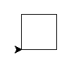

# 🐍 🐢

In this lesson, we will be drawing with the *turtle* module.

Run Python in *interactive mode* (after you activate Conda, write Python in the command line).

```pycon
$ python

>>>
```

> [note]
> The characters `>` and `$` are printed by the computer, not by you.
> On Windows, it will be `>` instead of `$`. 
> Before the `$` or `>`, there can be some other words.

Then write:

```python
from turtle import forward

forward(50)
```

Now a popup window will appear, don't close it.
Place it somewhere where you will be able to see it and
your command line, too.

## Where is the turtle?

Currently, the turtle is disguised as an arrow.
There is a way how to unmask it:

```python
from turtle import shape

shape('turtle')
```


## Rotation

The turtle can rotate and crawl across the "paper".
It has a brush on its tail which draws a line.

```python
from turtle import left, right

forward(50)
left(60)
forward(50)
right(60)
forward(50)
```

Now give the turtle some commands.
If you don't like the drawing you can close
the window, or import and use the function `clear()`.


## Turtle program

Interactive mode is good for trying new stuff
but we will now go back to our editors
and write some program in a file.

Create a file <code>~/pyladies/03/drawing.py</code>.

> [note]
> The directory <code>~/pyladies</code> can have a different name on your laptop
> – see [Python installation]({{ lesson_url('beginners/install') }}).

You can have a different name for your file, just don't use `turtle.py`.

Write drawing commands into the file
and in the end call the function `exitonclick`
(imported from module `turtle`).

> [note] Question
> What does the function <code>exitonclick</code> do?

After you are done, we can start with drawing pictures:

### Square

Draw a square.



A square has 4 equal straight sides
and 4 90° angles.


```python
from turtle import forward, left, exitonclick

forward(50)
left(90)
forward(50)
left(90)
forward(50)
left(90)
forward(50)
left(90)

exitonclick()
```


### Rectangle

Draw a rectangle.

Try to make it so that the turtle will "look" to the right in the end (like it was in the beginning).



```python
from turtle import forward, left, exitonclick

forward(100)
left(90)
forward(50)
left(90)
forward(100)
left(90)
forward(50)
left(90)

exitonclick()
```


### Three squares

Now draw three sqares, each rotated by 20°.



```python
from turtle import forward, left, exitonclick

forward(50)
left(90)
forward(50)
left(90)
forward(50)
left(90)
forward(50)
left(90)

left(20)

forward(50)
left(90)
forward(50)
left(90)
forward(50)
left(90)
forward(50)
left(90)

left(20)

forward(50)
left(90)
forward(50)
left(90)
forward(50)
left(90)
forward(50)
left(90)

exitonclick()
```


### Can we write it better?

So much code! There has to be a way how to simplify it.

There is.
Now we will learn the command `for`.

## Repetition

What does the following code do?
Save it as <code>~/pyladies/03/loop.py</code>

```python
for number in range(5):
    print(number)

for greeting in 'Ahoj', 'Hello', 'Hola', 'Hei', 'SYN':
    print(greeting + '!')
```

What does the command `for` do?


The command `for` repeats part of a program.
It repeats commands that are indented after `for`.
It's the same as with `if` - it applies only to
commands that are indented below.

The command `for x in range(n):` repeats the commands below <var>n</var> times
and it increments the variable `x` gradually from 0 to n-1.

The command `for x in a, b, c, d, ...:` repeats the commands below;
it increments the variable `x` gradually to <var>a</var>, <var>b</var>,
<var>c</var> <var>d</var>, ...


### Overwriting variables

What does the following program do?

```python
sum = 0

for number in 8, 45, 9, 21:
    sum = sum + number

print(sum)
```


The command `sum = sum + number` calculates the value of
`sum + number`, adds the current number to the sum,
and stores the result in the variable `sum`.
The new value of `sum` will be used in the next loop.

In the beginning the sum is 0, and in the end the sum of
our numbers will be printed.


### Square

Back to drawing! This time we will use loops.

Draw a square.

Use `forward` only twice, once in the import
and once as function.



```python
from turtle import forward, left, exitonclick

for i in range(4):
    forward(50)
    left(90)

exitonclick()
```


### Discontinuous line

The functions `penup` and `pendown` from the `turtle`
module tell the turtle to stop/start drawing.

Try to draw a discontinuous line.



```python
from turtle import forward, penup, pendown, exitonclick

for i in range(10):
    forward(10)
    penup()
    forward(5)
    pendown()

exitonclick()
```


Now try to make it so that the lines that are drawn become
gradually bigger.

![Turtle and discontinuous line]](static/turtle-dashed2.png)

> [note] Help
>
> What exactly does the command `for` do?
> Can we use the variable that it sets up?


```python
from turtle import forward, penup, pendown, left, exitonclick

for i in range(20):
    forward(i)
    penup()
    forward(5)
    pendown()

exitonclick()
```


### Three squares

Finally, draw 3 squares, each rotated by 20°.
Now you know how to write it in a simple way: repeat the code
by using `for`, do not copy the code. 



```python
from turtle import forward, left, right, speed, exitonclick

for i in range(3):
    for j in range(4):
        forward(50)
        left(90)
    left(20)

exitonclick()
```



## Extra tasks

When you are done, try to draw stairs:


When you are also done with the stairs, try to draw 7 hexagons:


