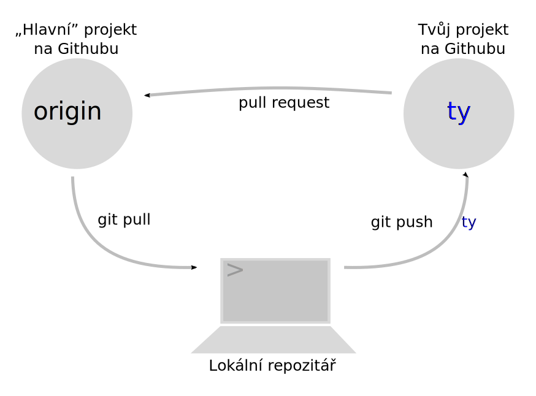
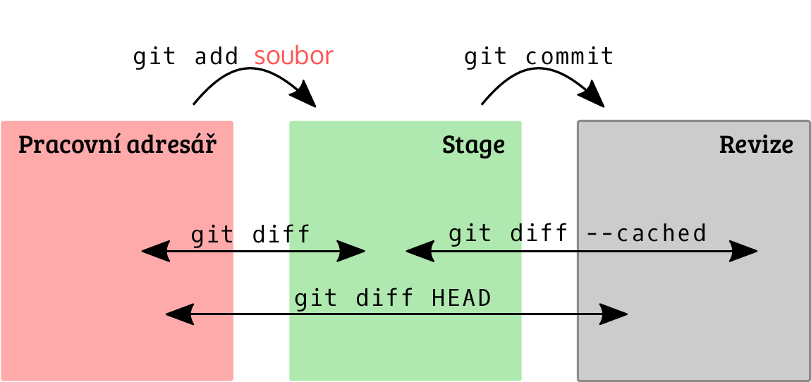

# Spolupráce a Git

„Opravdové” programy zřídka vznikají prací jednoho člověka. Víc hlav víc ví, a tak je dobré si na projekt vytvořit tým.
Každý člen týmu potřebuje mít přístup k práci ostatních. Jak ale zařídit to, aby několik lidí mohlo najednou upravovat
stejné části (soubory) programu? 

Určitě jste někdy použili nějaký nástroj na sdílení souborů jako je Dropbox nebo OneDrive. 
Tyto nástroje se většinou moc neumí vyrovnat s tím, když se změní jeden soubor najednou na dvou počítačích.
Většinou vytvoří 2 konfliktní kopie a je na uživatelích, aby našli v souborech změny a spojili je.

Takový způsob práce není ve velkém projektu s mnoha programátory udržitelný. 
Kód je většinou v mnoha souborech a přidání jedné nové funkcionality může vyžadovat změnu ve více souborech. 
Jen si představte jakou paseku by nadělalo pět programátorů v jedné Dropbox složce.

Zdrojový kód se dá poměrně dobře sdílet a přepoužívat, pokud je napsaný podle určitých pravidel. 
Spolupráce a sdílení kódu je spjato s programováním od nepaměti, už od prvních počítačů.
Tohle přepoužívání se postupně vyvinulo do fenoménu *open-source* a *svobodného softwaru*.

Dnes si vyzkoušíme, jak spolupracovat s mnoha programátory na jednom projektu pomocí verzovacího nástroje *Git* a služby *GitHub*.

## Git a GitHub

Představte si, že jste už napsali větší Python program, který je už kvůli složitosti a velikosti rozdělen do více souborů.
Takové složce s kódem říkáme repozitář.
Git je program, který se stará o to, abyste ve složce mohli dělat různé experimenty a vrátit se třeba ke starým verzím.
Každá verze má ale popis, který jste jí sami dali, takže slouží i jako dobrá dokumentace projektu.

A co víc – Git vám dovoluje sdílet kód s ostatními programátory.
Spousta míst na Internetu funguje tak, že vybraná skupina lidí má „přístup”: můžou dělat změny, jak se jim líbí.
S Gitem se používá jiný model: změny nahrajeme do vlastního sdíleného repozitáře 
a majiteli původního projektu napíšeme žádost o začlenění těch změn (angl. pull request). 
Může to být třeba mail se slovy „Hele, na té a té adrese mám nějaké změny, které by se ti mohly hodit! Přidej je do svého projektu!” 

Výhoda je v tom, že se do projektu ‒ pokud je veřejný ‒ může zapojit kdokoliv. 
Přispěvatel se nemusí předem ptát, nemusí dokazovat že je důvěryhodná osoba, stačí něco změnit a poslat. 
Jestli se změna bude autorům projektu líbit nebo ne, to už je jiná věc. 
Ale záleží hlavně na samotné změně, ne na tom, kdo ji udělal.
Většina projektů v README obsahuje návod, jak do projektu přispět (angl. Contribution Guidelines).
Zkuste se po nich podívat, ušetříte práci sobě i autorům.

Služba [GitHub](https://github.com) umožňuje vytvořit si vlastní sdílený gitový repozitář a zjednodušuje začleňování změn 
(místo posílání mailů stačí zmáčknout tlačítko).

Podobných služeb existuje víc (např. bitbucket.org, gitlab.com). Všechny fungují podobně; GitHub je momentálně nejpopulárnější.

Kdybyste měli v různých kopiích repozitáře zmatek, přijde vhod malé vysvětlení: jedna kopie je původní projekt na GitHubu, 
kam správce projektu dává aktuální „oficiální verzi”.
Další kopie na GitHubu je „vaše” a můžete si do ní nahrát cokoliv
(nejčastěji se v ní ale zveřejňují změny, které můžou být užitečné pro ostatní).
A třetí kopii repozitáře máte u sebe na počítači.



### Práce s lokálním repozitářem

Než budeme schopní poslat nějaké změny k začlenění do našeho vybraného projektu, musíme se naučit, jak se s Gitem pracuje.
Co je to vlastně ten zmíněný *repozitář*? Můžeme ho vytvořit z jakéhokoliv adresáře na disku, kde máme uložené soubory, 
jen Gitu řekneme, že z něj chceme ten repozitář udělat. To má za následek:

1. Git bude sledovat změny, které ve složce uděláme.
2. Budeme schopni vytvořit verzi tohoto adresáře, ke které se můžeme kdykoliv vrátit.
3. Můžeme nastavit vzdálené repozitáře, kam chceme změny nahrávat nebo naopak stahovat změny od jiných lidí. 

> [note] Pozor
> Budeme hodně pracovat s příkazovou řádkou. Jestli se s ní ještě nekamarádíš, koukni se na [úvod](../../beginners/cmdline/).
> Nezapomeň: $ na začátku se nepíše; je tu proto, aby šlo poznat, že jde o příkaz.

Naším dnešním cílem je ale přispět do projektu, který založil někdo jiný. Proto použijeme příkaz `git clone` ke stažení vzdáleného repozitáře.

```console
$ git clone https://github.com/asgeirrr/prezencka
```

V aktuálním adresáři se nám vytvořil podadresář `prezencka`, který obsahuje všechny soubory, které vidíme ve webovém rozhraní na [GitHubu](https://github.com/asgeirrr/prezencka).


#### Stav repozitáře (`git status`)

Velmi často potřebujeme zjistit současný stav repozitáře. Navigujte v příkazové řádce do adresáře `prezencka` a zadejte `git status`. Git nám odpoví:

```console
$ git status
On branch master
Your branch is up-to-date with 'origin/master'.
nothing to commit, working tree clean
```

Git nám v tuto chvíli poskytl 3 informace:

1. Že jsme na větvi `master`. Git umožňuje pracovat na více věcích současně pomocí tzv. *větví* mezi kterými můžeme přepínat. Pak se na na disku „objeví” verze souborů v dané větvi. My si dnes vystačíme s jednou hlavní větví, která se tradičně jmenuje `master`.
2. Že naše větev `master` je aktuální vůči větvi na vzdáleném repozitáři (origin) na GitHubu.
3. Že jsme neudělali žádné změny oproti poslední verzi souborů, což je pravda.

#### První revize (`git commit`)

Už jsme několikrát zmínili, že Git je verzovací systém. Jak že to ale soubory verzuje? 
V podstatě mu musíme dát příkaz, aby zmrazil současný stav repozitáře, tzv. vytvořit *revizi*.
Pak můžeme dělat další změny, ale už vždy budeme schopni se k této revizi vrátit.

Přidejte do adresáře `prezencka` soubor `vase_jmeno.txt`, např. tedy `magdalena_rettigova.txt`
a do něj napište svoje současné povolání nebo cokoliv jiného.
Zkontrolujte současný stav repozitáře pomocí `git status`: Git oznámí, že v adresáři je soubor, o kterém ještě „neví“. 

```console
$ git status
On branch master
Your branch is up-to-date with 'origin/master'.
Untracked files:
  (use "git add <file>..." to include in what will be committed)

      magdalena_rettigova.txt

nothing added to commit but untracked files present (use "git add" to track)
```

U každého nového souboru musíme Gitu říct, že chceme jeho obsah sledovat. Proveďte to se svým souborem:

```console
$ git add magdalena_rettigova.txt
```

a znovu zkontrolujte stav repozitáře:

```console
$ git status
On branch master
Your branch is up-to-date with 'origin/master'.
Changes to be committed:
  (use "git reset HEAD <file>..." to unstage)

        new file:   magdalena_rettigova.txt
```

To, co je zelené („changes to be committed“), se přidá do další revize (angl. commit), kterou vytvoříme. Pojďme tedy vytvořit revizi: 

```console
$ git commit
```

Po zadání tohoto příkazu se otevře editor, do kterého je nutné napsat výstižný popis změn, 
abyste vy i ostatní programátoři věděli, co tahle revize obsahuje za změny.
Např. tedy `Přidáno mé jméno a povolání`. Předvyplněné řádky začínající # můžeme nechat být
(nebo vymazat, podle chuti – Git je ignoruje).
Pak soubor uložíme a zavřeme editor. 

```console
$ git status
On branch master
Your branch is ahead of 'origin/master' by 1 commit.
  (use "git push" to publish your local commits)
nothing to commit, working tree clean
```

Pro lepší pochopení, co dělají jednotlivé příkazy a v jakém stavu můžou být soubory/změny, přikládáme tento diagram:



#### Log (`git log`)
Teď, když za sebou máme první revizi, podívejme se, jak vypadá historie repozitáře, do kterého chceme přispívat.
K tomu můžeme použít příkaz `git log`, jako první uvidíme naši poslední změnu a další jsou změny od jiných autorů,
na které navazujeme.

```console
$ git log
commit 0bdfbb2a2398fea179395a8dd303e9f672ef4dca
Author: Magdalena Dobromila <magdalena@rettigova.cz>
Date:   Tue Mar 28 19:27:08 2017 +0200

    Přidáno mé jméno a povolání

commit 0f305972803131cb6c8637359fee8ede3005bba6
Merge: effa89b 175f4cc
Author: Oskar Hollmann <oskar@hollmann.me>
Date:   Tue Nov 8 20:17:00 2016 +0100

    Merge pull request #1 from muzikovam/master

    Tady mas jmeno
```

V logu se pohybujeme šipkami a když z něj chceme vyskočit zpět, stiskneme `q` jako quit.
Příkaz `git log` má mnoho přepínačů, přehlednější historii změn můžeme získat pomocí `git log --oneline --graph --decorate`.

## Open-source a Free software

Dejme si menší pauzu na zažití základní práce s lokálním repozitářem.
Nejde mluvit o Gitu a spolupráci a nezastavit se chvíli u otevřeného zdrojového kódu.
První kód vznikal v akademické sféře, kde byl zcela přirozeně sdílen, jako je to s poznatky mezi vědci běžné.
50\. a 60. léta byla obdobím velké kreativity, kdy vzniklo mnoho z konceptů a technologií, které dnes používáme.
Pak se začalo programování postupně komercializovat a firmy začaly zdrojový kód skrývat jako konkurenční výhodu.
Do té doby víceméně jednolitá komunita programátorů byla nucena se rozdělit.

Některým programátorům tohle skrývání kódu hluboce vadilo až roku 1985 publikoval 
[Richard Stallman](https://en.wikipedia.org/wiki/Richard_Stallman) GNU Manifesto,
kde vysvětlil, proč hodlá vytvořit operační systém s otevřeným kódem a odstartoval tak hnutí svobodného softwaru.
To prosazuje 4 následujících svobody (převzato z [Wikipedie](https://cs.wikipedia.org/wiki/Svobodn%C3%BD_software)):

1. svoboda používat program za jakýmkoliv účelem,
2. svoboda studovat, jak program pracuje a možnost přizpůsobit ho svým potřebám,
3. svoboda redistribuovat kopie programu,
4. svoboda vylepšovat program a zveřejňovat zlepšení, aby z nich mohla mít prospěch celá komunita.
 
Dnes je spousta projektů s otevřeným zdrojovým kódem dostupných na Internetu a každý je používáme. 
Jejich další sdílení je upraveno jednou z licencí, které tyto základní svobody zaručují. 

> [note] Pozor
> Termíny **open-source** a **free software** nejsou zcela zaměnitelné, ale pro naše účely je zatím můžeme chápat jako synonyma.

Spoustu open-source projektů najdete právě na GitHubu. Ne všechny jsou v Pythonu. Ne všechny jsou kvalitní –
protože si každý může zveřejnit co chce, na GitHubu se válí spousta nedodělků, opuštěných nápadů a nepodařených experimentů. 
A bohužel, ne všechny projekty mají přátelské autory.

Na druhou stranu ale open-source programy mají svoje výhody: nejenom se z nich může kdokoli učit, 
ale každý může i zkontrolovat, jestli dělají to, co dělat mají.
Populární open-source programy nás například pravděpodobně nebudou špehovat (tj. hlásit autorovi, co na počítači děláme), 
ani většinou neobsahují reklamy: kdyby to dělaly, najde se někdo kdo tyhle „funkce” odstraní 
a lidé časem začnou používat opravenou verzi. 

Některé příklady populárních open-source projektů:

* Mozilla Firefox, Chromium (prohlížeče)
* Atom, gedit (textové editory)
* CPython (jazyk Python)
* Linux, Android (jádra operačních systémů)
* Pytest (pythonní knihovna na testování)
* Django, Flask, Requests (webové knihovny pro Python)
* NumPy, Jupyter, Matplotlib (pythonní knihovny pro vědce a analytiky)
* Materiály k tomuto kurzu

A jak vidno z posledního příkladu, nejen softwarové projekty se dají vést takhle veřejně. Tento kurz vychází z principů open source: 
všechno know-how je sdílené a budeme rádi, když se zapojíte.

Pokud vás tato problematika zajímá, doporučujeme krátkou knihu [Katedrála a tržiště](https://www.root.cz/knihy/katedrala-a-trziste/), která nabízí srovnání open-source s tradičním vývojem softwaru za zavřenými dveřmi.

Pokud budete někdy začínat nový projekt a budete chtít, aby z něj měl prospěch někdo další,
stojí za to uvolnit ho pod svobodnou licencí a dát třeba právě na GitHub.
Licence projektu většinou najdete v souboru `LICENCE`. 
Na kód neuvolněný pod svobodnou licencí se automaticky vztahuje copyright a ostatní ho nemohou volně sdílet.

Informace o open-source licencích najdete např. na [choosealicence.com](https://choosealicense.com), případně [creativecommons.org](https://creativecommons.org) a [opensource.org](https://opensource.org).

## Spolupráce na projektu

Nyní se posuneme ke sdílení revize, kterou jsme vytvořili, a ke stažení revizí od ostatních přispěvatelů.

### Posílání změn (`git push`)

Nyní stačí požádat autora projektu, aby naše změny začlenil do repozitáře na GitHubu 
a všichni uživatelé projektu, na kterém pracujeme, budou mít užitek z našich změn.
Nemáme ale do původního repozitáře práva na zápis, musíme tedy poslat změny nejprve do naší kopie repozitáře,
vizte obrázek na začátku.

Udělejte si účet na GitHubu (jestli ho ještě nemáte) a pak jděte na adresu [prezencky](https://github.com/asgeirrr/prezencka/),
kterou jste použili pro `git clone`. 
Vpravo nahoře je tlačítko „Fork”, klikněte na něj. Tím se na GitHubu vytvoří vaše kopie repozitáře:
adresa by měla být něco jako `https://github.com/tvojejmeno/prezencka`.

A teď, jak nahrát změny z našeho počítače na GitHub? Git si u každého repozitáře na našem počítači pamatuje adresy, 
odkud se dají stahovat a kam se dají posílat změny. 
Seznam těchto adres nám ukáže příkaz `git remote -v`. Třeba:

```console
$ git remote -v
origin  https://github.com/asgeirrr/prezencka (fetch)
origin  https://github.com/asgeirrr/prezencka (push)
```

Tenhle výstup znamená, že pod zkratkou *origin* se schovává adresa, ze které jsme repozitář naklonovali.

Přidejme si podobnou zkratku pro vlastní repozitář na GitHubu. Můžeme ho pojmenovat např. *moje*
nebo svým uživatelským jménem na GitHubu,
aby nám bylo jasné, že je to ten náš, do kterého můžeme nahrávat změny.

```console
$ git remote add tvojejmeno https://github.com/tvojejmeno/prezencka
```

Zkontrolujme, že se nám to povedlo:

```console
$ git remote -v
origin  https://github.com/asgeirrr/prezencka (fetch)
origin  https://github.com/asgeirrr/prezencka (push)
tvojejmeno  https://github.com/tvojejmeno/prezencka (fetch)
tvojejmeno  https://github.com/tvojejmeno/prezencka (push)
```

Tolik k nastavení ‒ `git remote add` stačí udělat jednou pro každý repozitář. Pak už můžeme změny nahrávat pomocí: 

```console
$ git push tvojejmeno master
```

což znamená: pošli na adresu uloženou pod zkratkou `tvojejmeno` větev `master`.

Funguje? Můžeme se podívat na `https://github.com/tvojejmeno/prezencka` v prohlížeči a ujistit se, že tam změny jsou.


### Žádost o začlenění (pull request)

Teď zbývá požádat autory původního projektu, aby změny z tvého sdíleného repozitáře přidali do svojí kopie. 
GitHub na to má vlastní mechanismus zvaný *pull request* (žádost o začlenění).

Na stránce původního projektu (na adrese, kterou jsme použili na začátku pro `git clone`)
by mělo být oznámení o nově nahrané větvi s velkým zeleným tlačítkem `Compare & pull request`. 
Po kliknutí na tlačítko můžeme doplnit popis toho, co tahle změna obnáší, a pak zmáčkneme další tlačítko.

Hotovo; teď je na autorech projektu, aby se na změny podívali a přijali ‒ nebo začali diskusi o tom, jak ji ještě vylepšit.
(Diskutovat se dá na stránce pull requestu nebo přes mail.)

> [note] Poznámka
> Procházíte-li materiály z domu, musíte počkat, než si někdo žádosti všimne a začlení ji.
> To může trvat i pár dní; kdyby to bylo přes týden, tak se zkuste se ozvat znovu.


### Aktualizace (`git pull`)

Když budou změny od všech účastníků začleněné, můžeme si aktualizovat repozitář, který máme u sebe na počítači. Příkaz

```console
$ git pull origin master
```

stáhne změny z větve „master” z adresy pod zkratkou „origin”.
Pomocí `git log` se můžeme podívat, jak se projekt mezitím vyvinul.

Kruh se uzavřel, jsme schopni začlenit do projektu vlastní změny a naopak si stáhnout změny od ostatních. 
Až příště uvidíte chyby v materiálech nebo nešikovnou formulaci, zkuste to opravit a udělat pull request.

Git je velké téma a mohli bychom probírat větvení nebo řešení konfliktů a spoustu dalšího,
ale nechme si to na pokračovací srazy nebo workshop. 
