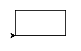
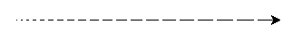

# 🐍 🐢

V této lekci si vyzkoušíš *želví kreslení*.

Pusť Python v *interaktivním módu* (bez souboru .py).

```pycon
$ python

>>>
```

> [note]
> (Znaky `>` a `$` píše počítač, ne ty.
> Na Windows bude místo `$` znak
> `>` a před `$` nebo
> `>` může být ještě něco dalšího.)

Pak napiš:

```python
from turtle import forward

forward(50)
```

Ukáže se okýnko se šipkou, které nezavírej.
Dej ho tak, abys viděla i příkazovou řádku
i nové okýnko.

## A kde je ta želva?

Želva je převlečená za šipku. Ale dá se odmaskovat:

```python
from turtle import shape

shape('turtle')
```


## Otáčení

Želva se umí otáčet a lézt po papíře.
Na ocase má připevněný štětec, kterým kreslí čáru.

```python
from turtle import forward, left, right

forward(50)
left(60)
forward(50)
right(60)
forward(50)
```

Zkus chvíli dávat želvě příkazy.
Když se ti něco nelíbí, můžeš buď zavřít kreslící okno,
nebo naimportovat a použít funkci `clear()`.


## Želví program

Interaktivní mód je skvělý na hraní,
ale teď přejdeme zase na soubory.

Vytvoř si v editoru nový soubor.
Ulož ho do adresáře pro dnešní lekci pod jménem `zelva.py`.

> [note]
> Jestli adresář pro dnešní lekci ještě nemáš, vytvoř si ho!
> Pojmenuj ho třeba `03`.

Jestli chceš pro soubor použít jiné jméno, můžeš, ale
nepojmenovávej ho `turtle.py`.

Do souboru napiš příkazy na nakreslení obrázku
a na konec zavolej funkci `exitonclick`
(importovanou z modulu `turtle`).

> [note] Otázka
> Co dělá funkce <code>exitonclick</code>?

Až to budeš mít hotové, zkusíme začít kreslit
obrázky:

### Čtverec

Nakresli čtverec.


Čtverec má čtyři rovné strany
a čtyři rohy po 90°.


```python
from turtle import forward, left, exitonclick

forward(50)
left(90)
forward(50)
left(90)
forward(50)
left(90)
forward(50)
left(90)

exitonclick()
```


### Obdélník

Nakresli obdélník.

Zkus zařídit, aby se po nakreslení „dívala” želva doprava (tak jako na začátku).




```python
from turtle import forward, left, exitonclick

forward(100)
left(90)
forward(50)
left(90)
forward(100)
left(90)
forward(50)
left(90)

exitonclick()
```


### Tři čtverce

Nakresli tři čtverce, každý otočený třeba o 20°.



```python
from turtle import forward, left, exitonclick

forward(50)
left(90)
forward(50)
left(90)
forward(50)
left(90)
forward(50)
left(90)

left(20)

forward(50)
left(90)
forward(50)
left(90)
forward(50)
left(90)
forward(50)
left(90)

left(20)

forward(50)
left(90)
forward(50)
left(90)
forward(50)
left(90)
forward(50)
left(90)

exitonclick()
```


### Jde to líp?

Tolik kódu! Tohle musí jít nějak zjednodušit!

Jde.
Pojďme se naučit příkaz `for`.

## Opakování

Udělej v editoru nový soubor, ulož ho jako `cyklus.py`, a napiš do něj
následující program.
Pak zkus co dělá.

```python
for cislo in range(5):
    print(cislo)

for pozdrav in 'Ahoj', 'Hello', 'Hola', 'Hei', 'SYN':
    print(pozdrav + '!')
```

Co dělá příkaz `for`?


Příkaz `for` opakuje část programu.
Opakují se příkazy, které jsou pod `for`-em odsazené.
Podobně jako se `if` vztahuje jen na odsazené příkazy pod ním.

Příkaz `for x in range(n):` opakuje příkazy pod ním <var>n</var>-krát
a proměnnou `x` nastaví postupně na čísla od 0 do <var>n</var>-1.

Příkaz `for x in a, b, c, d, ...:` opakuje příkazy pod ním;
proměnnou `x` nastavuje postupně na <var>a</var>, <var>b</var>,
<var>c</var> <var>d</var>, ...


### Přepisování proměnných

Zkus popsat, jak pracuje následující program.

```python
soucet = 0

for cislo in 8, 45, 9, 21:
    soucet = soucet + cislo

print(soucet)
```


Příkaz `soucet = soucet + cislo` vypočítá hodnotu
`soucet + cislo`, tedy přičte aktuální číslo k součtu
a výsledek uloží do proměnné `soucet`.
Nová hodnota součtu se pak použije v dalším průchodu cyklem.

Na začátku je součet 0 a na konci se součet všech čísel vypíše.


### Čtverec

A znovu ke kreslení, tentokrát s použitím cyklů.

Nakresli čtverec.

V programu použij `forward` jen dvakrát:
jednou v importu, jednou jako volání.



```python
from turtle import forward, left, exitonclick

for i in range(4):
    forward(50)
    left(90)

exitonclick()
```


### Přerušovaná čára

Funkce `penup` a `pendown`
z modulu `turtle` řeknou želvě,
aby přestala, resp. začala kreslit.

Zkus nakreslit přerušovanou čáru.



```python
from turtle import forward, penup, pendown, exitonclick

for i in range(10):
    forward(10)
    penup()
    forward(5)
    pendown()

exitonclick()
```


Pak zkus zařídit, aby jednotlivé čárky byly postupně
větší a větší.



> [note] Nápověda
>
> Co přesně dělá příkaz `for`?
> Dá se využít proměnná, kterou nastavuje?


```python
from turtle import forward, penup, pendown, left, exitonclick

for i in range(20):
    forward(i)
    penup()
    forward(5)
    pendown()

exitonclick()
```


### Tři čtverce

Nakonec nakresli 3 čtverce, každý otočený o 20°.
Tentokrát už víš, jak to dělat chytře: opakuj pomocí příkazu
`for`, ne kopírováním kódu.



```python
from turtle import forward, left, right, speed, exitonclick

for i in range(3):
    for j in range(4):
        forward(50)
        left(90)
    left(20)

exitonclick()
```



## Úkol navíc

Máš-li hotovo, zkus nakreslit schody:


A máš-li i schody, zkus nakreslit těchto šest (nebo sedm?) šestiúhelníků:


