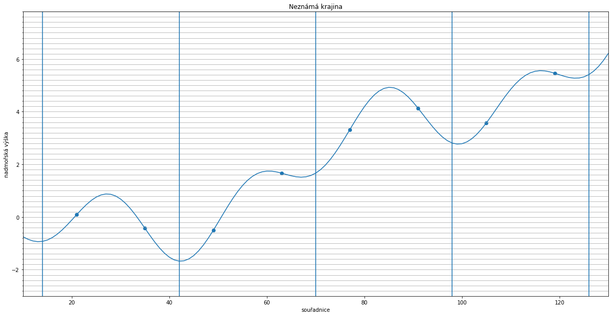

# Domácí příprava na první hodinu strojového učení
**Povinné** :)

Konečně se dočkáte Úvodu do strojového učení a seznámení s
regresí. Vzhledem  k situaci bude hodina ještě mnohem experimentálnější než se
čekalo, proto Vás prosíme o shovívavost a hlavně spolupráci.

Hodinu jsme připravovali tak, aby byla co nejvíce interaktivní. Proto jsme
ji nechtěli (a stále nechceme) učit online. Není ale jiné cesty, tak nám pojďte
pomoci.

**Nechceme vám říkat, jak se věci mají dělat, chceme, abyste věděli, co chcete
dělat a proč. Proto je naším cílem donutit vás, abyste si správný postup
vymysleli sami.** K tomu potřebujeme, abyste se v hodině nebáli odpovídat na
otázky, zapojovat do debaty a nebát se sdílet vaše nápady. Nebudeme přes video
mít moc možností, jak vás k tomu donutit, tak se zkuste předem psychicky
nachystat na to, že od vás budeme chtít slyšet vaše názory a řešení. Žádná
odpověď není špatná, s čímkoli přijdete, bude plus. Nebojte se, úplně stačí,
že se bojíme my.

A začneme domácími úkoly:

1. Stáhněte si toto [PDF](static/krajina.pdf) a pokud máte možnost vytiskněte.

3.  Představ si, že sis najala zeměměřiče a vyslala ho do neznámé
    krajiny. Zadala jsi mu souřadnice několika bodů (žiješ teď v zjednodušeném
    prostoru, souřadnice je tedy pouze jedno číslo) a on pro tebe naměřil
    zeměpisnou výšku v těchto bodech. Naměřené body máš zobrazeny na staženém
    obrázku.

	Po naměření těchto bodů se zeměměřič rozhodl státi datovým analytikem,
    přihlásil se na kurz od PyLadies a s měřením definitivně skončil.  Nás by
    ale zajímalo, jak by asi tak mohla celá krajina vypadat.

	Pokud nerozumíš staženému obrázku, podívej se na tento obrázek:
	 

	Na vodorovné ose máme souřadnici a na svislé ose nadmořskou výšku (ta může
	být i záporná, hladina moře stoupla díky globálnímu oteplování).  Modré
	body ukazují naměřené hodnoty ve vybraných bodech, nakreslená křivka
	skutečnou krajinu (měření jsou v tomto případě přesná, v realitě to tak být
	nemusí).

	Vezmi si tužku a zkus si na staženém obrázku nakreslit krajinu tak, jak si ji dle daných měření představuješ. (Nejde nám o
    interpolaci! Není nutné, aby tvoje *čára* vedla přímo skrz dané
    body. Uvědom si, že měření mohou být zatížena chybou. Zeměměřič také měřil
    pouze v bodech, které jsi mu zadala (vybrala náhodně), nemusí to tedy být
    ani vrcholy, ani údolí, ani jiné význačné body.)

	Zkus odpovědět na následující otázky:

    **Otázky:**

    + Jsi si svým odhadem jistá? Existuje více možností, jak by mohla
        krajina vypadat?

    + Jak bys změřila (vyčíslila) kvalitu své schopnosti
        odhadovat neznámou krajinu?

    + Pokud bys měla k dispozici dvě řešení, jak by se dalo určit, které  z
        nich krajinu vystihuje lépe?

    **NEZAPOMEŇ:**
    - Negooglit, přemýšlet. Nehledat materiály na hodinu, řešení tam stejně
    není.
    - Nejde o správnou odpověď, jde o to shromáždit co nejvíc nápadů, abychom
    mohli na hodině správné řešení společně hledat. Špatná
    odpověď neexistuje!
    - Chceme znát všechno, co tě napadne, i když ti to třeba bude připadat
    jako hloupý nápad.
    - Pokud jsi v kontaktu s dalšími účastnicemi kurzu, nebojte se vymýšlet
    společně.
    - Nechápeš-li zadání, chyba není na tvé straně. Ozvi se na slacku nebo
    mailem, dovysvětlíme.

3. Obrázek vyfoť a spolu s odpověďmi na otázky pošli na slacku do soukromé
   zprávy nebo na mail frenzy.madness@gmail.com. Na začátku hodiny vaše nápady
   shrneme (nikdo nebude jmenován) a pobavíme se o nich.

4. Obrázek nezahazuj, budeš ho v hodině ještě potřebovat!

5. V první hodině nebudeme vůbec řešit implementaci (nebude se nic
   programovat), ale kvůli funkčnosti notebooků s materiály si nainstalujte
   knihovnu scikitlearn.
   ```
   pip install sklearn
   ```
