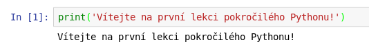

# Jupyter Notebook intro

Jupyter Notebook je webový editor sloužící k vytváření komplexních dokumentů,
které mohou mimo strukturovaného textu a obrázků obsahovat také
kód ([nejen v Pythonu](https://github.com/jupyter/jupyter/wiki/Jupyter-kernels)),
grafy, matematické vzorce (LaTeX) a další interaktivní prvky.

Z jiného pohledu se jedná o velmi praktickou konzoli pro Python, kde je veškerá
historie uložena a dá se k ní vrátit nebo ji změnit, a tím ovlivnit zbytek
výpočtů.

Jupyter Notebook se hodí všude tam, kde potřebuješ ihned vidět výsledky
své práce či postupovat krok za krokem, předat někomu komplexní program spolu
s vizualizacemi a výsledky, připravit si prezentaci či datovou analýzu atp.

## Spuštění

Po úspěšné instalaci lze Jupyter Notebook spustit v aktivním virtuálním prostředí
jednoduchým příkazem:

```shell
(venv)$ jupyter notebook
```

Pokud ti tento příkaz nefunguje, vyzkoušej následující:

```shell
(venv)$ python -m notebook
```

Po spuštění Notebooku se automaticky spustí i webový prohlížeč, ve kterém se
ti editor zobrazí.

> Notebook pracuje vždy v té složce, ve které byl spuštěn, proto je rozumné
přejít před jeho spuštěním do složky, ve které chceš mít výsledné dokumenty
uloženy.


Na první obrazovce vidíš obsah složky, ve které je Notebook spuštěn. Jakmile
budeš mít nějaké dokumenty vytvořeny, objeví se zde a budeš se k nim moci vrátit
a pokračovat v práci.

Nový dokument vytvoříš tak, že si vpravo nahoře klikneš na `New` > `Python 3`.
Touto volbou vybereš Python 3 jako jazyk, který budeš v rámci dokumentu používat.
Notebook jich zvládne daleko více, a tak si na své přijdou úplně všichni.

## Uživatelské rozhraní


Notebook nemá nijak složité rozhraní. Na prvním řádku najdeš informaci o názvu
dokumentu a posledním uložení, pod tím pak ovládací prvky a hlavní nabídku.
Ještě kousek níže pak prázdnou buňku čekající na první obsah.

Vpravo vedle nápisu „Python 3“ je malé, ale užitečné kolečko. Pokud nám během práce
zčerná, znamená to, že je Python zaneprázdněn vykonáváním našich příkazů a je
třeba počkat, až jejich provádění dokončí, anebo, pokud jsi například omylem
vytvořil nekonečný cyklus, že je třeba Python (neboli kernel) restartovat.

## Základní použití

Jako první krok si nový dokument přejmenuj. Klikni na prvním řádku na nápis
„Untitled“ a zvol si nějaké smysluplné jméno.

Teď zkus do první buňky napsat nějaký příkaz v Pythonu a stisknout klávesovou
zkratku `Shift` + `Enter`.

> Do jedné buňky lze zapsat libovolně velký kus kódu i s prázdnými řádky, proto
se k jeho spuštění musí místo pouhého Enteru použít klávesová zkratka.
Smysluplnější je ale dělit kód po menších částech, aby se dal lépe kontrolovat.



Podobně můžeš pokračovat i dále. Vždy do buňky vložíš nějaký kód a pak jej
spustíš. Pokud buňka obsahuje nějaký výstup nebo něco vrací, ukáže se výsledek
po spuštění buňky hned pod ní. Pro výstup to ale platí, jen pokud je na posledním
řádku buňky, zatímco `print` může být v buňce kdekoli.


Funguje to jako klasický program, takže záleží na pořadí v jakém se jednotlivé
buňky provedly. Musíš například nejdříve uložit nějaký obsah do proměnné, než ji
budeš moci použít. Tohle pravidlo je důležité mít na paměti, protože buňky
v Notebooku se dají spouštět nezávisle na sobě v libovolném pořadí. V jakém
pořadí k jejich spuštění došlo, se dá zjistit z čísel, která se po spuštění
objeví  v hranatých závorkách vlevo od buňky. Pokud se po spuštění místo čísla objeví `*`, znamená to, že
Python pracuje a na výsledek si budeme muset chvilku počkat.

Takhle to může vypadat, pokud se správné pořadí nedodrží:


> I když to není nutnost, bývá zvykem psát dokumenty v Notebooku tak, aby se
buňky daly spustit v pořadí, ve kterém jdou za sebou. Když jej pak někomu pošleš,
bude si moci snadno spustit tvůj kód kousek po kousku a sledovat, co se v něm
děje. Mimoto je v hlavní nabídce i možnost `Kernel` > `Restart & Run All`, která
restartuje Python a následně spustí všechny buňky v dokumentu.

Všimni si, jak buňky měni barvu. Pokud je okraj buňky zelený, je možné ji
editovat a pomocí šipek se pohybovat v kódu, který obsahuje. Pokud je modrý, dá
se šipkami přecházet mezi jednotlivými buňkami. Z modrého do zeleného režimu
se dostaneme klávesou `Enter`, případně kliknutím do buňky. Naopak ze zeleného
do modrého režimu pomocí klávesy `Esc`.

Pro ovládání Notebooku je dobré se naučit klávesové zkratky, které práci s ním
usnadní a zrychlí. Jejich seznam je možné zobrazit pomocí klávesy `h`.

> Klávesové zkratky se používají v modrém režimu, jinak bychom místo
speciálních akcí psali jednotlivé znaky do buněk.

Mezi ty nejdůležitější patří:

* `h` zobrazí nápovědu
* `a` vloží novou buňku nad aktuální
* `b` vloží buňku pod aktuální
* `x` vyjme buňku
* `c` kopíruje buňku
* `v` vloží kopírovanou nebo vyjmutou buňku pod aktuální
* `Shift` + `v` vloží kopírovanou nebo vyjmutou buňku nad aktuální
* `Ctrl` + `s` uloží dokument
* `m` přepne buňku z pythonového kódu na text

**Nejdůležitější klávesová zkratka** je hned ta první - `h` - s její pomocí
se totiž velice rychle dostanete k seznamu všech ostatních.

## Typy obsahu

Základním typem buňky je buňka s kódem, která umí úplně vše, co z Pythonu
už znáš.


### Text

Stiskem klávesy `m` (v modrém režimu) můžeme buňku přepnout z režimu pythonového
kódu do režimu textu, který nám umožní dokumenty obohatit o spoustu různého obsahu.
Že je buňka v textovém režimu, poznáme podle toho, že nalevo od ní už nebude modré
označení `In [ ]`. Zatímco u buňek s Pythonem se nám po spuštění programu výsledek
vypíše pod buňku, textová buňka se po spuštění pouze vykreslí ve formě textu.

### Markdown

Obyčejný text by sám o sobě nebyl tak zajímavý a k přehlednosti nepřispěje o nic
více než obyčejný komentář. Proto máme možnost jej formátovat a do jisté míry
tak upravit jeho vzhled, ale hlavně strukturu. K formátování se používá
značkovací jazyk [Markdown](https://cs.wikipedia.org/wiki/Markdown). Markdown
umožňuje formátovat text pomocí obyčejných znaků.

Například:

* Text začínající `#` se po spuštění buňky stane automaticky nadpisem první
úrovně. `##` pak udělají druhou úroveň atd.
* Když text uvodíme hvězdičkami – `*třeba takto*` – bude napsán *kurzivou*.
Dvojice hvězdiček na každé straně pak udělá text **tučný**.
* Když bude několik řádků začínat hvězdičkou, stane se z nich seznam s odrážkami.
Když na začátku použijeme čísla, bude seznam číslovaný.
* Odkazy vypadají takto: `[text odkazu](cesta či URL adresa)` – do hranatých
závorek na začátek se napíše text odkazu a do kulatých závorek pak cesta k cíli
či URL adresa.
* Obrázky vypadají téměř stejně jako odkazy, jen mají na začátku před první
hranatou závorkou vykřičník: ``

Tímto způsobem jednoduše formátovaný text by mohl vypadat následovně:


Výsledek takového formátování pak může po spuštění buněk vypadat například
takto:


### LaTeX

Pokud potřebuješ zapsat do dokumentu nějaké rovnice či vzorce, můžeš k tomu
použít LaTeX. Latexovou formuli stačí začít a ukončit pomocí `$$`.

Například zápis `$$ c = \sqrt(a^2 + b^2)$$` bude po spuštění buňky vypadat takto:


## Další užitečné funkce

Notebook má celou řadu vymožeností, které nám ulehčí práci s ním.

### Nápověda

Když za název funkce (místo kulatých závorek) nebo modulu napíšeš otazník
(např.: `print?`), objeví se ti po spuštění takové buňky nápověda. Ta je navíc
zobrazena mimo hlavní dokument, a tak nepřekáží v další práci a může zůstat
otevřená déle.

Kratší nápovědu (tzv. dokumentační řetězec) je možné zobrazit během psaní kódu pomocí
klávesové zkratky `Shift` + `Tab`. Ta zobrazí dokumentační řetězec dané funkce
v malé bublině u aktivní buňky.

### Speciální příkazy

Příkazy začínající znakem procenta mají v notebooku speciální význam. Například
`%time` dokáže změřit a zobrazit, jak dlouho trvalo vykonání kódu napsaného na řádku bezprostředně za tímto příkazem.

Speciální příkazy začínající dvěmi procenty (např.: `%%time`) pak mají efekt na celou
buňku místo jednoho řádku.

Seznam všech speciálních příkazů lze získat pomocí `%lsmagic`.

### Příkazy shellu

V buňkách notebooku je možné velmi snadno spouštět i příkazy z příkazové řádky.
Příkaz ke spuštění v příkazové řádce místo Pythonu stačí začít znakem vykřičníku
(např.: `!ls`)

## Pokračování

Notebook toho umí opravdu hodně a také v něm budou napsány i materiály pro
následující kapitoly, což nám umožní prokládat teorii praktickými
příklady i s grafy a obrázky a zájemcům si vyzkoušet s příklady experimentovat.

Nicméně na vývoj klasických aplikací a obecně pro projekty se složitější strukturou je stále 
lepší kód rozdělit do modulů a editovat ho ve vhodném textové editoru.
Častou praxí je nejdříve v interaktivním prostředí notebooku rychle poskládat funkční
prototyp a následně jej přetvořit v klasickou aplikaci.
